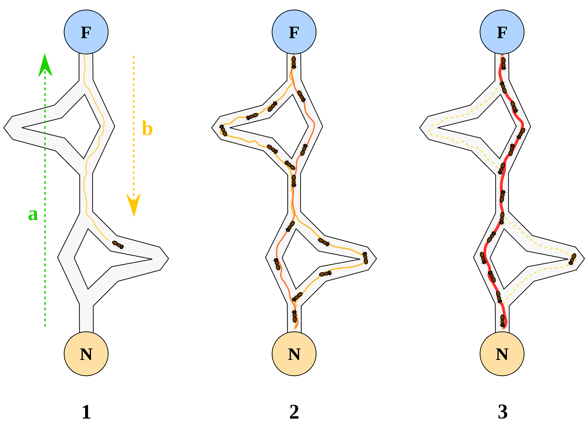
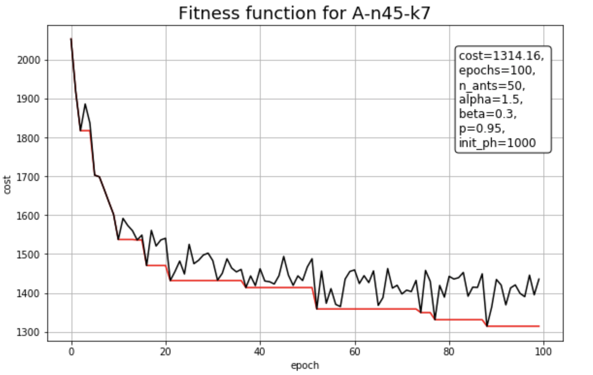

# Ant Colony Optimisation Algorithm  for solving Vehicle Routing Problem  
  

## Structure of the repo
* [report](https://github.com/kislN/AntColonyVRP/blob/master/report.ipynb) with analysis of the ACO algorithm 
* [implementation](https://github.com/kislN/AntColonyVRP/blob/master/algorithms/ant_colony.py) of the ACO algorithm
* input and output [data](https://github.com/kislN/AntColonyVRP/tree/master/data)
* [tools](https://github.com/kislN/AntColonyVRP/tree/master/tools) for data loading, testing, comparing and other

## Fitness function of ACO
 

## Obtained result
[Solutions](https://github.com/kislN/AntColonyVRP/tree/master/data/solutions)

|benchmark|epochs|n_ants|alpha|beta|rho |init_pher|mean_time|found_cost|opt_cost|error |
|---------|------|------|-----|----|----|---------|---------|----------|--------|------|
|A-n32-k5 |100   |100   |1.5  |0.3 |0.95|1000     |31.0902  |840.7085  |784.0   |0.0723|
|A-n33-k5 |100   |50    |1.5  |0.3 |0.95|1000     |17.45445 |759.7473  |661.0   |0.1493|
|A-n33-k6 |100   |100   |1.5  |0.3 |0.95|1000     |39.4328  |824.0234  |742.0   |0.1105|
|A-n34-k5 |100   |100   |1.5  |0.1 |0.95|1000     |36.65715 |865.7229  |778.0   |0.1127|
|A-n36-k5 |100   |100   |1.5  |0.1 |0.95|1000     |37.42615 |941.048   |799.0   |0.1777|
|A-n37-k5 |100   |100   |1.5  |0.3 |0.95|1000     |34.72325 |827.0217  |669.0   |0.2362|
|A-n37-k6 |100   |100   |1.5  |0.3 |0.95|1000     |45.1742  |1098.5397 |949.0   |0.1575|
|A-n38-k5 |100   |100   |1.5  |0.3 |0.95|1000     |41.6064  |831.4388  |730.0   |0.1389|
|A-n39-k5 |100   |100   |1.5  |0.3 |0.95|1000     |42.3003  |922.5199  |822.0   |0.1222|
|A-n39-k6 |100   |100   |1.5  |0.3 |0.95|1000     |47.4383  |938.2681  |831.0   |0.1290|
|A-n44-k6 |100   |100   |1.5  |0.3 |0.95|1000     |54.8001  |1071.6804 |937.0   |0.1437|
|A-n45-k6 |100   |100   |1.5  |0.1 |0.95|1000     |57.4604  |1123.2443 |944.0   |0.1898|
|A-n45-k7 |100   |100   |1.5  |0.3 |0.95|1000     |58.953   |1321.2444 |1146.0  |0.1529|
|A-n46-k7 |100   |100   |1.5  |0.1 |0.95|1000     |58.96205 |1121.8012 |914.0   |0.2273|
|A-n48-k7 |100   |100   |1.5  |0.3 |0.95|1000     |64.0681  |1292.9723 |1073.0  |0.2050|
|A-n53-k7 |100   |100   |1.5  |0.3 |0.95|1000     |72.03915 |1230.8324 |1010.0  |0.2186|
|A-n54-k7 |100   |100   |1.5  |0.1 |0.95|1000     |72.0944  |1366.4645 |1167.0  |0.1709|
|A-n55-k9 |100   |100   |1.5  |0.3 |0.95|1000     |90.30875 |1286.7343 |1073.0  |0.1991|
|A-n60-k9 |100   |100   |1.5  |0.3 |0.95|1000     |95.5338  |1654.2528 |1354.0  |0.2217|
|A-n61-k9 |100   |100   |1.5  |0.3 |0.95|1000     |106.98715|1261.4101 |1034.0  |0.2199|
|A-n62-k8 |100   |100   |1.5  |0.3 |0.95|1000     |90.25915 |1602.115  |1288.0  |0.2438|
|A-n63-k10|100   |100   |1.5  |0.3 |0.95|1000     |114.5476 |1640.7818 |1314.0  |0.2486|
|A-n63-k9 |100   |50    |1.5  |0.3 |0.95|1000     |55.53265 |1884.8819 |1616.0  |0.1663|
|A-n64-k9 |100   |100   |1.5  |0.3 |0.95|1000     |110.1165 |1677.3008 |1401.0  |0.1972|
|A-n65-k9 |100   |100   |1.5  |0.3 |0.95|1000     |112.73695|1424.3889 |1174.0  |0.2132|
|A-n69-k9 |100   |50    |1.5  |0.3 |0.95|1000     |59.1424  |1416.3391 |1159.0  |0.2220|
|A-n80-k10|100   |100   |1.5  |0.3 |0.95|1000     |148.4076 |2227.146  |1763.0  |0.2632|
|B-n31-k5 |100   |50    |1.5  |0.1 |0.95|10       |16.34135 |714.3029  |672.0   |0.0629|
|B-n34-k5 |100   |100   |1.5  |0.3 |0.95|1000     |34.2074  |830.59    |788.0   |0.0540|
|B-n35-k5 |100   |100   |1.5  |0.1 |0.95|10       |36.32685 |1011.7098 |955.0   |0.0593|
|B-n38-k6 |100   |100   |1.5  |0.1 |0.95|1000     |44.6124  |895.1143  |805.0   |0.1119|
|B-n39-k5 |100   |50    |1.5  |0.3 |0.95|10       |20.8248  |634.6591  |549.0   |0.1560|
|B-n41-k6 |100   |100   |1.5  |0.3 |0.95|1000     |49.2865  |892.5873  |829.0   |0.0767|
|B-n43-k6 |100   |100   |1.5  |0.1 |0.95|1000     |47.91175 |820.7286  |742.0   |0.1061|
|B-n44-k7 |100   |50    |1.5  |0.1 |0.95|1000     |28.34285 |1006.9213 |909.0   |0.1077|
|B-n45-k5 |100   |100   |1.5  |0.3 |0.95|1000     |48.9257  |839.7059  |751.0   |0.1181|
|B-n45-k6 |100   |100   |1.5  |0.3 |0.95|1000     |57.04055 |724.3774  |678.0   |0.0684|
|B-n50-k7 |100   |100   |1.5  |0.3 |0.95|1000     |62.14785 |868.6793  |741.0   |0.1723|
|B-n50-k8 |100   |50    |1.5  |0.1 |0.95|1000     |35.81775 |1409.6985 |1312.0  |0.0744|
|B-n51-k7 |100   |100   |1.5  |0.3 |0.95|1000     |71.9902  |1059.7313 |1032.0  |0.0268|
|B-n52-k7 |100   |100   |1.5  |0.3 |0.95|1000     |70.2877  |832.6004  |747.0   |0.1145|
|B-n56-k7 |100   |100   |1.5  |0.3 |0.95|10       |77.8671  |873.309   |707.0   |0.2352|
|B-n57-k7 |100   |100   |1.5  |0.3 |0.95|1000     |80.5894  |1235.8289 |1153.0  |0.0718|
|B-n57-k9 |100   |100   |1.5  |0.3 |0.95|1000     |91.4484  |1771.8331 |1598.0  |0.1087|
|B-n63-k10|100   |100   |1.5  |0.3 |0.95|1000     |116.1213 |1747.8    |1496.0  |0.1683|
|B-n64-k9 |100   |100   |1.5  |0.1 |0.95|1000     |111.46845|990.3758  |861.0   |0.1502|
|B-n66-k9 |100   |100   |1.5  |0.3 |0.95|1000     |116.3869 |1477.4993 |1316.0  |0.1227|
|B-n67-k10|100   |100   |1.5  |0.3 |0.95|10       |126.58145|1250.5999 |1032.0  |0.2118|
|B-n68-k9 |100   |100   |1.5  |0.3 |0.95|10       |118.7391 |1479.7776 |1272.0  |0.1633|
|B-n78-k10|100   |100   |1.5  |0.3 |0.95|1000     |142.44425|1511.2385 |1221.0  |0.2377|
